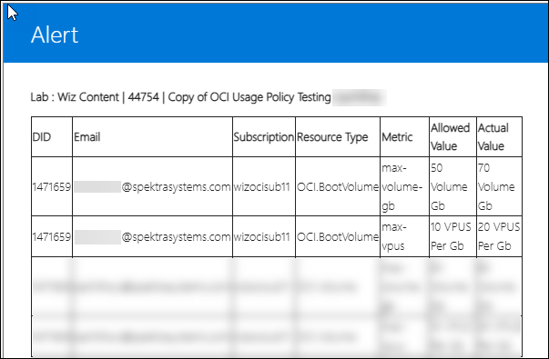

# OCI Resource Usage Policy

### Overview

OCI Resource Usage Policy is used to monitor the cores and clusters of OCI resources that are predefined for a user.

### Prerequisites

Before adding the OCI Resource Usage Policy in the Template, ensure you have the following prerequisites:      
  
- Admin access to [CloudLabs Admin Portal](https://admin.cloudlabs.ai/) (If access is unavailable, kindly reach out to your point of contact or [CloudLabs Support](https://docs.cloudlabs.ai/RequestSupport)).

### Adding OCI Resource Usage Policy

1. Log in to the CL portal and navigate to the required tenant (WIZ). On the left-hand side of the page, you will see the Template section.

2. Navigate to the **Templates (1)** section in the left menu and click on the **edit (2)** button.

   

3. Scroll down to the **Usage Policy** section and provide the Usage Policy URL for the respective OCI resource. 
   
   

4. Then, click the **Submit** button.

   

### Usage Policy and Alerts Outputs

Below are the Resource Usage Policy and Alerts outputs for the respective resources.

1. **Instance** : 

   i. The metric used is **count of instances.**

   - Policy:

      ```
      [
        {
          "ResourceType": "OCI.Instance",
      
          "Parameter": [
            {
              "Name": "max-ocpu-cores",
      
              "Value": "1"
            },
      
            {
              "Name": "max-memory-gb",
      
              "Value": "32"
            },
      
            {
              "Name": "max-instance-count",
      
              "Value": "1"
            }
          ]
        }
      ] 
      ```

   - Output:

       In the OCI Console: 

       

       Alert: 
        
       

   ii. The metrics used include **OCPU Cores** and **Memory (GB).**

   - Output:

       In the OCI Console: 

       

       Alerts: 

       

2. **Bucket** : The metric used is **Storage (GB).** 

   - Policy:

      ```
      [
        {
        "ResourceType": "OCI.Bucket",
        "Parameter": [
            {
            "Name": "max-storage-gb",
            "Value": "1"
            }
          ]
        }
      ]
      ```

   - Output:

       In the OCI Console: 

         

3. **Boot Volume** : The metrics used include **VPUs (per GB)** and **Volume (GB).**

   - Policy:

      ```
      [
        {
          "ResourceType": "OCI.BootVolume",
          "Parameter": [
            {
              "Name": "max-volume-gb",
              "Value": "50"
            },
            {
              "Name": "max-vpus",
              "Value": "10"
            }
          ]
        }
      ]
      ```

   - Output:

       In the OCI Console: 

       

       Alert: 
        
       

4. **Block Volume** : The metrics used include **VPUs (per GB)** and **Volume (GB).**

   - Policy:

      ```
      [
        {
          "ResourceType": "OCI.Volume",
      
          "Parameter": [
            {
              "Name": "max-volume-gb",
      
              "Value": "50"
            },
      
            {
              "Name": "max-vpus",
      
              "Value": "10"
            }
          ]
        }
      ]
      ```

   - Output:

       In the OCI Console: 

       

       Alert: 
        
       

5. **Boot Volume Backup** : The metric used is **Volume (GB).**

   - Policy:

      ```
      [
        {
          "ResourceType": "OCI.BootVolumeBackup",
          "Parameter": [
            {
              "Name": "max-volume-gb",
              "Value": "4"
            }
          ]
        }
      ]
      ```

   - Output:

       In the OCI Console: 

       

       Alert: 
        
       

6. **Block Volume Backup** : The metric used is **Volume (GB).** 

   - Policy:

      ```
      [
        {
          "ResourceType": "OCI.VolumeBackup",
      
          "Parameter": [
            {
              "Name": "max-volume-gb",
      
              "Value": "6"
            }
          ]
        }
      ]
      
      ```

   - Output:

       In the OCI Console: 

       

     
7. **File System** : The metric used is **Storage (GB).**

   - Policy
   
     ```
     [
       {
          "ResourceType": "OCI.FileSystem",
          "Parameter": [
            {
              "Name": "max-storage-gb",
              "Value": "1"
             }
            ]
         }
      ]
     
     ```
   
   - Output
       In the OCI Console:
     
       
        
       Alert:

       

8. **PostgreSQL DB System** : The metrics used include **max-ocpu-cores**, **max-memory-gb**, **max-nodes**, and **max-iops**.

   - Policy
     ```
     [
         {
           "ResourceType": "OCI.PostgreSqlDbsystem",
            "Parameter": [
              {
                  "Name": "max-memory-gb",
                  "Value": "30"
              },
              {
                  "Name": "max-nodes",
                  "Value": "1"
              },
  	          {
                  "Name": "max-iops",
                  "Value": "70000"
              }
            ]
         }
     ]
     ```

   - Output
        
       Alert:

       


9.  **DB System** :  The metrics used include **max-nodes**, **max-cluster-memory-gb**, **max-storage-gb**, **max-memory-gb**, and **max-cpu-cores**.

   i. The metric used is

   - Policy
     ```
     [
         {
            "ResourceType": "OCI.DbSystem",
             "Parameter": [
                {
                    "Name": "max-cpu-cores",
                    "Value": "1"
                },
                {
                    "Name": "max-memory-gb",
                    "Value": "16"
                },
                {
                    "Name": "max-storage-gb",
                    "Value": "1024"
                },
                {
                    "Name": "max-cluster-memory-gb",
                    "Value": "32"
                },
                {
                    "Name": "max-nodes",
                    "Value": "1"
                }
             ]
         }
     ]
     ```

   - Output

       Alert:

       

10. **Autonomous Database** :  The metrics used include **max-ecpu-cores**, **max-ocpu-cores**, **max-storage-gb**.

   i. The metric used is

   - Policy
     ```
     [
         {
            "ResourceType": "OCI.AutonomousDatabase",
            "Parameter": [
                {
                    "Name": "max-ocpu-cores",
                    "Value": "1"
                },
                {
                    "Name": "max-ecpu-cores",
                    "Value": "1"
                },
                {
                    "Name": "max-storage-gb",
                    "Value": "1024"
                }
             ]
         }
     ]

   - Output
        
       Alert:

       

    
Below is the usage policy URL for all OCI resources, including Volume Backup, Boot Volume Backup, Boot Volume, Functions, DB System, Autonomous Database, PostgreSQL DB System, File System, Volume, Bucket, and Instance.

   - Policy URL: https://cloudlabs-prod-templates-s3.s3.amazonaws.com/WIZ/test/OCI+Usage+Policy/usagepolicyOCI.json 


